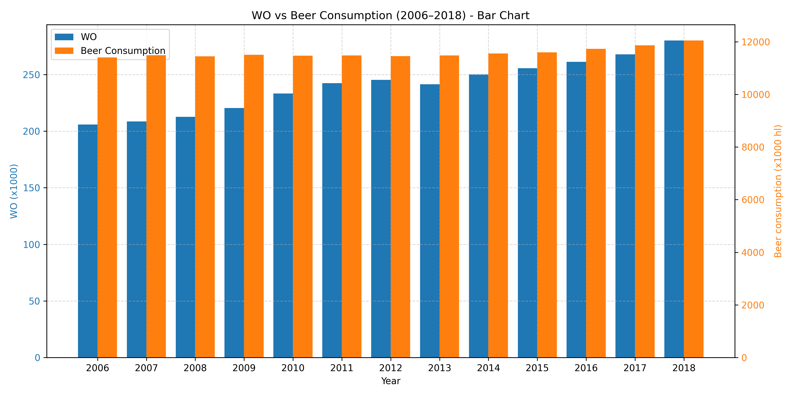

studentID: 16272862

The Rise of Coccidioides: Forces Against the Dust Devil Unleashed
An analysis of the forces required to drag sheep over various surfaces
The neurocognitive effects of alcohol on adolescents and college students

The histogram shows a strong correlation between hectoliters of beer consumed and the number of university students in the Netherlands: alcoholism?
